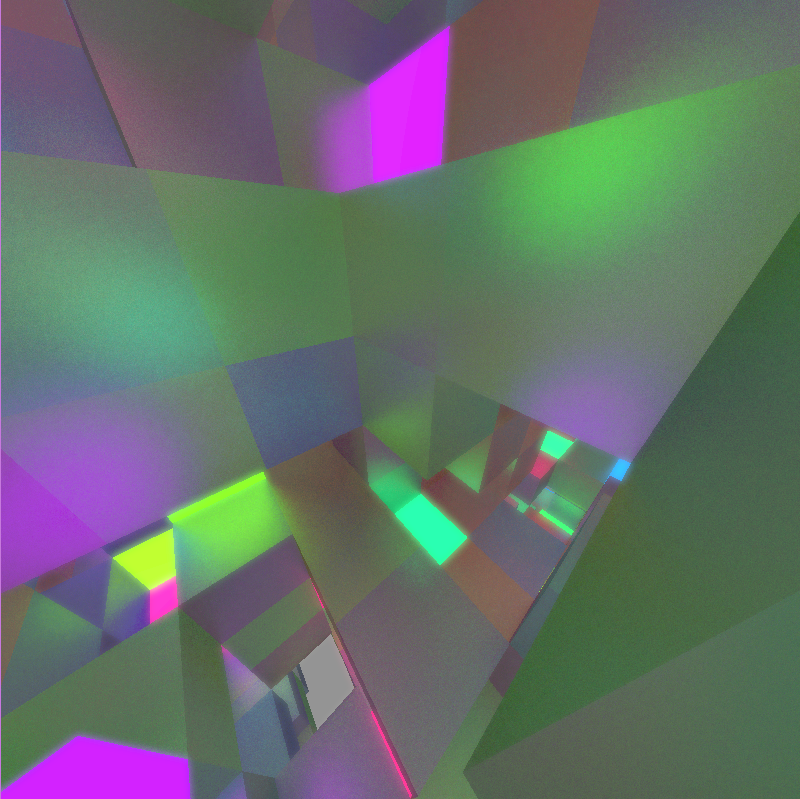

# vtrace
vtrace is a simple real-time voxel path tracer, written in C / GLSL, and using OpenGL. The only dependencies are OpenGL and GLFW.

vtrace uses Sparse Voxel Octrees to compress voxel data and accelerate ray traversal. Samples are accumulated over time while the scene is static to improve image quality.

vtrace is free / libre software licensed under the GPL v3.0.

